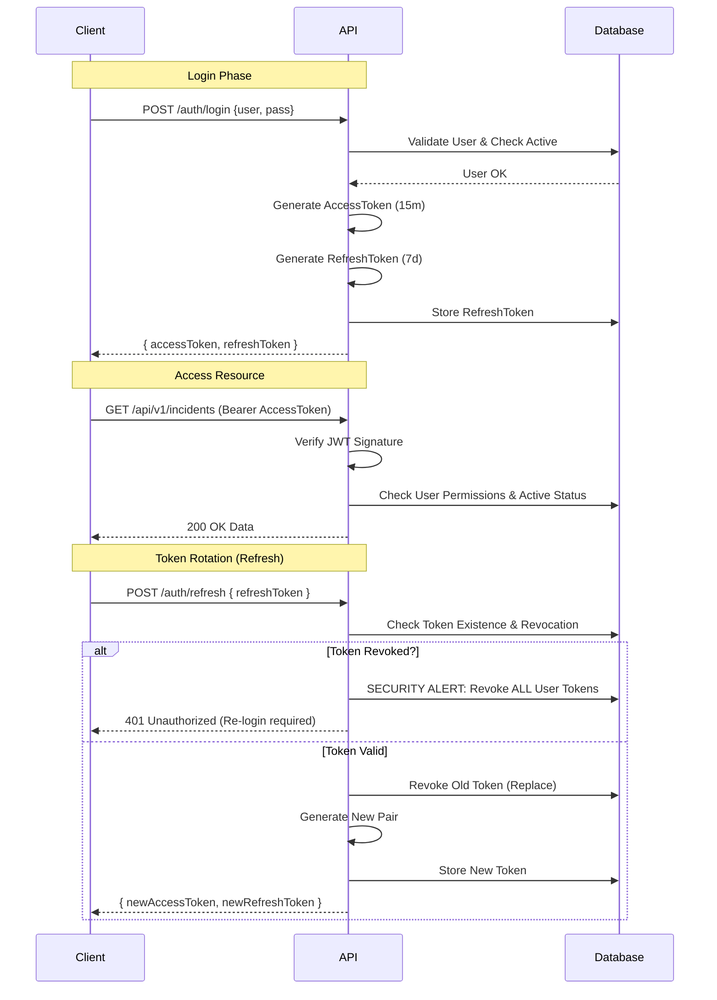

# Enterprise Node.js API

Documentation technique du backend SI d'entreprise.

## 📋 Vue d'ensemble

API RESTful développée en Node.js avec une architecture **Clean / Hexagonale** stricte.
Conçue pour un déploiement On-Premise avec haute sécurité et observabilité.

### Stack Technique

- **Runtime**: Node.js LTS
- **Framework**: Express.js
- **Base de données**: Microsoft SQL Server
- **ORM**: Prisma
- **Sécurité**: Helmet, CORS, Rate Limiting, JWT (Access + Refresh)
- **Logs**: Winston (JSON structuré)

---

## 🚀 Installation & Configuration

### Prérequis

- Node.js v18+
- SQL Server (Local ou Serveur dédié)
- npm ou pnpm

### Variables d'environnement

Créer un fichier `.env` à la racine :

```ini
# Server
PORT=3000
NODE_ENV=development
CORS_ORIGIN=*

# Database (SQL Server connection string)
DATABASE_URL="sqlserver://localhost:1433;database=EnterpriseDB;user=sa;password=Password123;encrypt=true;trustServerCertificate=true"

# Security (Secrets forts requis en prod)
JWT_SECRET="complex_access_secret_key_32_chars"
JWT_REFRESH_SECRET="complex_refresh_secret_key_32_chars"

# Logging
LOG_LEVEL=info
```

### Installation

```bash
# Installer les dépendances
npm install

# Générer le client Prisma
npm run prisma:generate

# Appliquer les migrations BDD
npm run prisma:migrate
```

### Démarrage

```bash
# Mode développement (hot reload)
npm run dev

# Mode production
npm run build
npm start
```

---

## 🔐 Authentification & Sécurité

### Flow d'Authentification

L'API utilise un système de double token (Access + Refresh) avec rotation sécurisée pour prévenir le vol de session.



### Matrice RBAC (Role-Based Access Control)

Les permissions sont granulaires. Un utilisateur possède des rôles, qui possèdent des permissions.

| Ressource  | Actions       | Permission Requise |
|------------|---------------|--------------------|
| Incident   | Create        | `INCIDENT_CREATE`  |
| Incident   | Read          | `INCIDENT_READ`    |
| Incident   | Update        | `INCIDENT_UPDATE`  |
| Incident   | Delete        | `INCIDENT_DELETE`  |
| Site       | Create        | `SITE_CREATE`      |
| Auth       | Login         | *(Public)*         |
| Monitoring | Health/Ready  | *(Public)*         |

---

## 📡 Documentation API

La spécification OpenAPI 3.0 complète est disponible dans le fichier :
`docs/openapi.json`

Pour visualiser la documentation :
1. Ouvrir **Postman** > Import > File > `docs/openapi.json`
2. Ou utiliser **Swagger Editor** en ligne et coller le contenu.

---

## 🛠 Maintenance & Observabilité

### Endpoints de Monitoring

- `GET /health` : Liveness probe (Check si le processus Node répond).
- `GET /ready` : Readiness probe (Check si la BDD SQL Server est connectée).

### Logs

Les logs sont structurés en JSON pour ingestion par ELK/Datadog.

- **correlation-id** : Propagé via le header `X-Correlation-ID` pour tracer une requête à travers le système.
- **Audit** : Toutes les opérations d'écriture (POST/PUT/DELETE) génèrent un log d'audit dédié (`level: info` avec métadonnées `audit`).

Exemple de log d'audit :
```json
{
  "level": "info",
  "message": "AUDIT: User jdoe performed POST on /api/v1/incidents",
  "correlationId": "123e4567-e89b-12d3-a456-426614174000",
  "timestamp": "2023-10-27 10:00:00:123",
  "audit": {
    "who": "user-uuid",
    "what": "POST",
    "target": "/api/v1/incidents",
    "status": "SUCCESS"
  }
}
```
