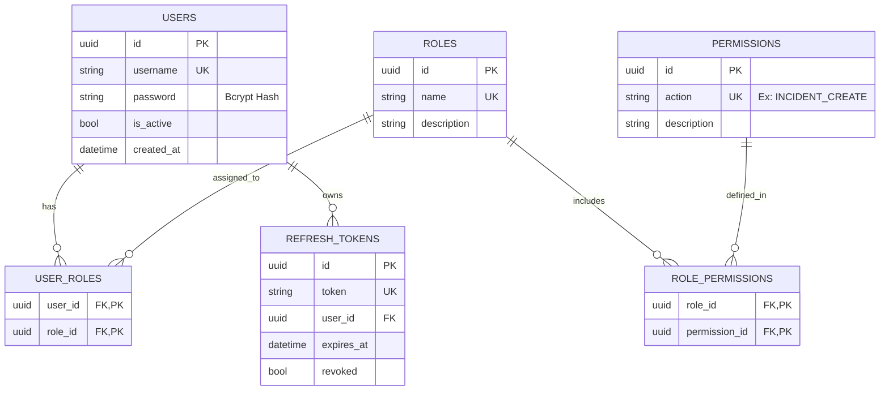

# Schéma Relationnel RBAC (SQL Server)

Ce module gère l'authentification et les autorisations.

## Diagramme Textuel

## Description des Tables

1.  **users**: Comptes utilisateurs. Mot de passe stocké hashé uniquement.
2.  **roles**: Groupes logiques de permissions (Ex: `SUPER_ADMIN`, `MANAGER`).
3.  **permissions**: Actions atomiques autorisées (Ex: `INCIDENT_CREATE`).
4.  **user_roles**: Table de liaison N-N. Un utilisateur a N rôles.
5.  **role_permissions**: Table de liaison N-N. Un rôle a N permissions.
6.  **refresh_tokens**: Tokens de sécurité longue durée pour le mécanisme JWT Access/Refresh.
